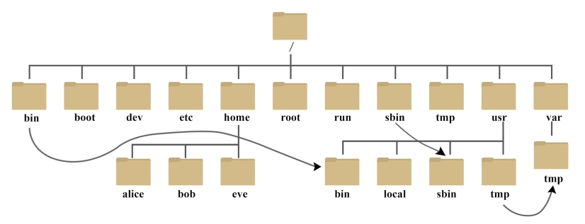

## 简介
Linux 是一套免费使用和自由传播的类 Unix 操作系统，是一个基于 POSIX 和 UNIX 的多用户、多任务、支持多线程和多 CPU 的操作系统。

Linux 能运行主要的 UNIX 工具软件、应用程序和网络协议。它支持 32 位和 64 位硬件。Linux 继承了 Unix 以网络为核心的设计思想，是一个性能稳定的多用户网络操作系统。

## 文件系统

Linux一切皆文件，只有一个顶级目录



## 网络相关命令
> TODO


## 程序运行相关命令

### nohup

nohup 命令运行由 Command参数和任何相关的 Arg参数指定的命令，忽略所有挂断（SIGHUP）信号。
```
nohup Command [ Arg ... ] [　& ]
```

后台运行程序并且不打印输出
```bash
nohup command >/dev/null &
```

错误输出和标准输出打印到同一个文件
```bash
nohup command 2>&1
```
