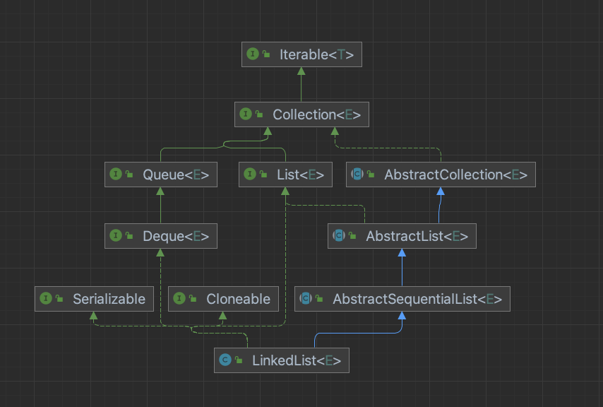

## 概述

`LinkedList` 同时实现了 `List` 接口和 `Deque` 接口，它既可以当成顺序容器，又可以作为双端队列使用，同时还可以看作一个栈（Stack）。栈和队列还有一个更好的选择是 `ArrayDeque`，它有比 `LinkedList` 更好的性能。

## 类图



`LinkedList` 实现了四个接口：

* `java.util.List` List 接口
* `java.io.Serializable` 序列化接口
* `java.lang.Cloneable` 可克隆接口
* `java.util.Deque` 双端队列接口

另外，`LinkedList` 继承了 `java.util.AbstractSequentialList` 抽象类，它是 `AbstracList` 的子类，实现了只能**连续**访问“数据存储” 等随机操作的方法，官方推荐对于支持随机访问数据的继承 `AbstractList` 抽象类，不支持的继承 `AbstractSequentialList` 抽象类。

## 属性

LinkedList 有三个被 `transient` 修饰的属性，如下所示：

```java
// 链表长度
transient int size = 0;

// 头结点
transient Node<E> first;

// 尾结点
transient Node<E> last;
```

`Node<E>` 为内部类：

```java
private static class Node<E> {
    // 元素
    E item;
    // 前一个结点
    Node<E> next;
    // 后一个结点
    Node<E> prev;

    Node(Node<E> prev, E element, Node<E> next) {
        this.item = element;
        this.next = next;
        this.prev = prev;
    }
}
```

- 对于第一个节点来说，prev 为 null；
- 对于最后一个节点来说，next 为 null；
- 其余的节点呢，prev 指向前一个，next 指向后一个。

## 构造方法

```java
public LinkedList() {
}

// 按照集合的迭代器返回的顺序构造一个包含指定集合元素的列表
public LinkedList(Collection<? extends E> c) {
    this();
    // 将集合 c 的元素全部添加到链表中
    addAll(c);
}
```

## 方法

### 链表基本操作

> 在 LinkedList 内部，提供了在链表头部、中间以及尾部操作数据的基本方法，例如 `linkFirst`、`linkBefore`、`linkLast` 等等，再通过这些基本方法的调用，来实现满足不同数据结构定义的操作。

#### 添加元素

```java
// 链接 e 作为第一个元素
private void linkFirst(E e) {
    // 获取头结点
    final Node<E> f = first;
    // 创建新结点，prev 指向 null，next 指向当前头结点
    final Node<E> newNode = new Node<>(null, e, f);
    // 新结点作为新的头结点
    first = newNode;
    // 如果原头结点为 null，则原链表为空
    if (f == null)
        // 新结点也是尾结点
        last = newNode;
    else
        // 原头结点的 prev 指向新结点
        f.prev = newNode;
    size++;
    modCount++;
}

// 在非空节点 succ 之前插入元素 e
void linkBefore(E e, Node<E> succ) {
    // succ 不可以为空
    // 获取 succ 的 前一个结点
    final Node<E> pred = succ.prev;
    // 创建新结点，prev 指向 succ 的前一个结点，next 指向 succ
    final Node<E> newNode = new Node<>(pred, e, succ);
    // succ 的 prev 指向新结点
    succ.prev = newNode;
    // 判断 succ 是不是头结点
    if (pred == null)
        // succ 是头结点，头结点指向新结点
        first = newNode;
    else
        // succ 前一个结点的 next 指向新结点
        pred.next = newNode;
    size++;
    modCount++;
}

// 在链表末尾添加元素
void linkLast(E e) {
    // 获取尾结点
    final Node<E> l = last;
    // 创建新结点，pre 当前的尾结点，next 为 null
    final Node<E> newNode = new Node<>(l, e, null);
    // 新结点称为尾结点
    last = newNode;
    // 判断原来的尾结点是否为 null，即判断整个链表是否为空
    if (l == null)
        // 链表为空，新加入的结点是第一个结点，头结点也指向它
        first = newNode;
    else
        // 链表不为空，前序结点的 next 指向新加入的结点
        l.next = newNode;
    size++;
    modCount++;
}
```

#### 删除元素

```java
// 取消第一个非空节点 f 的链接
private E unlinkFirst(Node<E> f) {
    // assert f == first && f != null;
    final E element = f.item;
    final Node<E> next = f.next;
    f.item = null;
    f.next = null; // help GC
    first = next;
    if (next == null)
        last = null;
    else
        next.prev = null;
    size--;
    modCount++;
    return element;
}

// 
E unlink(Node<E> x) {
    // assert x != null;
    final E element = x.item;
    final Node<E> next = x.next;
    final Node<E> prev = x.prev;

    if (prev == null) {
        first = next;
    } else {
        prev.next = next;
        x.prev = null;
    }

    if (next == null) {
        last = prev;
    } else {
        next.prev = prev;
        x.next = null;
    }

    x.item = null;
    size--;
    modCount++;
    return element;
}

private E unlinkLast(Node<E> l) {
    // assert l == last && l != null;
    final E element = l.item;
    final Node<E> prev = l.prev;
    l.item = null;
    l.prev = null; // help GC
    last = prev;
    if (prev == null)
        first = null;
    else
        prev.next = null;
    size--;
    modCount++;
    return element;
}
```

#### 查询元素

1. 返回指定元素索引处的（非空）节点

```java
Node<E> node(int index) {
    // assert isElementIndex(index);

    if (index < (size >> 1)) {
        Node<E> x = first;
        for (int i = 0; i < index; i++)
            x = x.next;
        return x;
    } else {
        Node<E> x = last;
        for (int i = size - 1; i > index; i--)
            x = x.prev;
        return x;
    }
}
```


### 集合方法

> 当 LinkedList 作为 List 使用时常用的方法

#### 添加元素

1. 将指定元素附加到此列表的末尾

```java
public boolean add(E e) {
    linkLast(e);
    return true;
}
```

2. 在此列表中的指定位置插入指定元素

```java
public void add(int index, E element) {
    checkPositionIndex(index);

    if (index == size)
        linkLast(element);
    else
        linkBefore(element, node(index));
}
```

3. 按照指定集合的迭代器返回的顺序

```java
public boolean addAll(Collection<? extends E> c) {
    return addAll(size, c);
}
```

4. 将指定集合中的所有元素插入此列表，从指定位置开始

```java
public boolean addAll(int index, Collection<? extends E> c) {
    checkPositionIndex(index);

    Object[] a = c.toArray();
    int numNew = a.length;
    if (numNew == 0)
        return false;

    Node<E> pred, succ;
    if (index == size) {
        succ = null;
        pred = last;
    } else {
        succ = node(index);
        pred = succ.prev;
    }

    for (Object o : a) {
        @SuppressWarnings("unchecked") E e = (E) o;
        Node<E> newNode = new Node<>(pred, e, null);
        if (pred == null)
            first = newNode;
        else
            pred.next = newNode;
        pred = newNode;
    }

    if (succ == null) {
        last = pred;
    } else {
        pred.next = succ;
        succ.prev = pred;
    }

    size += numNew;
    modCount++;
    return true;
}
```

#### 删除元素

1. 移除此列表中指定位置的元素

```java
public E remove(int index) {
    checkElementIndex(index);
    return unlink(node(index));
}
```

2. 从此列表中删除第一次出现的指定元素（如果存在）

```java
public boolean remove(Object o) {
    if (o == null) {
        for (Node<E> x = first; x != null; x = x.next) {
            if (x.item == null) {
                unlink(x);
                return true;
            }
        }
    } else {
        for (Node<E> x = first; x != null; x = x.next) {
            if (o.equals(x.item)) {
                unlink(x);
                return true;
            }
        }
    }
    return false;
}
```

#### 更新元素

* 将此列表中指定位置的元素替换为指定元素

```java
public E set(int index, E element) {
   checkElementIndex(index);
   Node<E> x = node(index);
   E oldVal = x.item;
   x.item = element;
   return oldVal;
}
```

#### 查询元素

1. 返回此列表中指定位置的元素

```java
public E get(int index) {
    checkElementIndex(index);
    return node(index).item;
}
```

2. 返回此列表中指定元素第一次出现的索引

```java
public int indexOf(Object o) {
    int index = 0;
    if (o == null) {
        for (Node<E> x = first; x != null; x = x.next) {
            if (x.item == null)
                return index;
            index++;
        }
    } else {
        for (Node<E> x = first; x != null; x = x.next) {
            if (o.equals(x.item))
                return index;
            index++;
        }
    }
    return -1;
}
```

3. 返回此列表中指定元素最后一次出现的索引

```java
public int lastIndexOf(Object o) {
    int index = size;
    if (o == null) {
        for (Node<E> x = last; x != null; x = x.prev) {
            index--;
            if (x.item == null)
                return index;
        }
    } else {
        for (Node<E> x = last; x != null; x = x.prev) {
            index--;
            if (o.equals(x.item))
                return index;
        }
    }
    return -1;
}
```

4. 如果此列表包含指定元素，则返回true 

```java
public boolean contains(Object o) {
    return indexOf(o) != -1;
}
```

5. 清除列表

```java
public void clear() {
    // Clearing all of the links between nodes is "unnecessary", but:
    // - helps a generational GC if the discarded nodes inhabit
    //   more than one generation
    // - is sure to free memory even if there is a reachable Iterator
    for (Node<E> x = first; x != null; ) {
        Node<E> next = x.next;
        x.item = null;
        x.next = null;
        x.prev = null;
        x = next;
    }
    first = last = null;
    size = 0;
    modCount++;
}
```
#### 其他

1. 转换为数组

```java
public Object[] toArray() {
    Object[] result = new Object[size];
    int i = 0;
    for (Node<E> x = first; x != null; x = x.next)
        result[i++] = x.item;
    return result;
}

public <T> T[] toArray(T[] a) {
    if (a.length < size)
        a = (T[])java.lang.reflect.Array.newInstance(
                            a.getClass().getComponentType(), size);
    int i = 0;
    Object[] result = a;
    for (Node<E> x = first; x != null; x = x.next)
        result[i++] = x.item;

    if (a.length > size)
        a[size] = null;

    return a;
}
```

2. 序列化

```java
private void writeObject(java.io.ObjectOutputStream s)
    throws java.io.IOException {
    // Write out any hidden serialization magic
    s.defaultWriteObject();

    // Write out size
    s.writeInt(size);

    // Write out all elements in the proper order.
    for (Node<E> x = first; x != null; x = x.next)
        s.writeObject(x.item);
}
```

3. 反序列化

```java
private void readObject(java.io.ObjectInputStream s)
    throws java.io.IOException, ClassNotFoundException {
    // Read in any hidden serialization magic
    s.defaultReadObject();

    // Read in size
    int size = s.readInt();

    // Read in all elements in the proper order.
    for (int i = 0; i < size; i++)
        linkLast((E)s.readObject());
}
```


### 双端队列方法


### 添加元素

> 在链表中添加元素分为三种情况：
>
> * 添加元素到链表头
> * 添加元素到链表中间（指定结点前）
> * 添加元素到链表末尾
>
> 链表内部提供了这三种方式的基本方法 `linkFirst`、`linkBefore`、`linkLast`，`LinkedList` 同时还实现了 `Deque` 接口，有关队列操作的接口也都是通过调用这三个基本方式实现的。

1. 添加元素到链表头 `push(E e)`、 `addFirst(E e)`、`offerFirst`

```java
// 入栈
public void push(E e) {
    addFirst(e);
}

public void addFirst(E e) {
    linkFirst(e);
}

public boolean offerFirst(E e) {
    addFirst(e);
    return true;
}

// 链接 e 作为第一个元素
private void linkFirst(E e) {
    // 获取头结点
    final Node<E> f = first;
    // 创建新结点，prev 指向 null，next 指向当前头结点
    final Node<E> newNode = new Node<>(null, e, f);
    // 新结点作为新的头结点
    first = newNode;
    // 如果原头结点为 null，则原链表为空
    if (f == null)
        // 新结点也是尾结点
        last = newNode;
    else
        // 原头结点的 prev 指向新结点
        f.prev = newNode;
    size++;
    modCount++;
}
```

2. 在指定结点前插入元素 `add(int index, E element)`

```java
public void add(int index, E element) {
    // 检查 index 是否越界
    checkPositionIndex(index);

    if (index == size)
        // 如果 index 等于 size，表示在最后插入
        linkLast(element);
    else
        // 调用 linkBefore，其中通过 node(index) 方法获取 index 位置的结点，具体见下文
        linkBefore(element, node(index));
}

// 在非空节点 succ 之前插入元素 e
void linkBefore(E e, Node<E> succ) {
    // succ 不可以为空
    // 获取 succ 的 前一个结点
    final Node<E> pred = succ.prev;
    // 创建新结点，prev 指向 succ 的前一个结点，next 指向 succ
    final Node<E> newNode = new Node<>(pred, e, succ);
    // succ 的 prev 指向新结点
    succ.prev = newNode;
    // 判断 succ 是不是头结点
    if (pred == null)
        // succ 是头结点，头结点指向新结点
        first = newNode;
    else
        // succ 前一个结点的 next 指向新结点
        pred.next = newNode;
    size++;
    modCount++;
}
```

3. 在链表末尾插入结点 `add(E e)`、`addLast(E e)`、`offerLast(E e)`

```java
public boolean add(E e) {
    linkLast(e);
    return true;
}

public void addLast(E e) {
    linkLast(e);
}

public boolean offerLast(E e) {
    addLast(e);
    return true;
}
```

### 删除元素

> 在链表中删除元素同样分为三种情况：
>
> * 从链表头删除元素
> * 从链表中间删除元素
> * 从链表尾删除元素
>
> 链表内部提供了三种删除方式对应的方法：

1. 从链表头删除元素 `pop()`、`removeFirst()`、`poll()`、`remove()`

```java
// 从此列表表示的堆栈中弹出一个元素。换句话说，删除并返回此列表的第一个元素。
// 此方法等效于removeFirst() 
public E pop() {
    return removeFirst();
}

// 检索并删除此列表的第一个元素，如果此列表为空，则返回null 
public E pollFirst() {
    final Node<E> f = first;
    return (f == null) ? null : unlinkFirst(f);
}

// 检索并删除此双端队列的第一个元素。此方法与pollFirst的不同之处仅在于如果此双端队列为空，它将引发异常
public E removeFirst() {
    final Node<E> f = first;
    if (f == null)
        throw new NoSuchElementException();
    return unlinkFirst(f);
}

// 检索并删除此队列的头部，如果此队列为空，则返回null 
public E poll() {
    final Node<E> f = first;
    return (f == null) ? null : unlinkFirst(f);
}

// 检索并删除此队列的头部。此方法与poll的不同之处仅在于如果此队列为空，它将引发异常
public E remove() {
    return removeFirst();
}
```

2. 从链表中间删除元素


2. 从链表尾删除元素

```java

```

## 参考资料

* [Java 程序员进阶之路](https://tobebetterjavaer.com/collection/gailan.html)
* [Java全栈知识体系](https://pdai.tech/md/java/collection/java-collection-all.html)