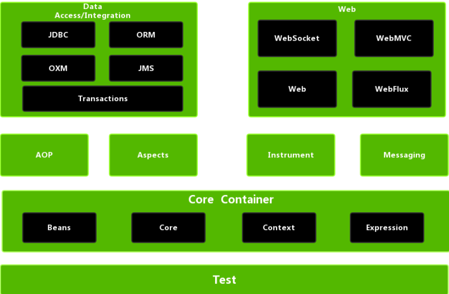
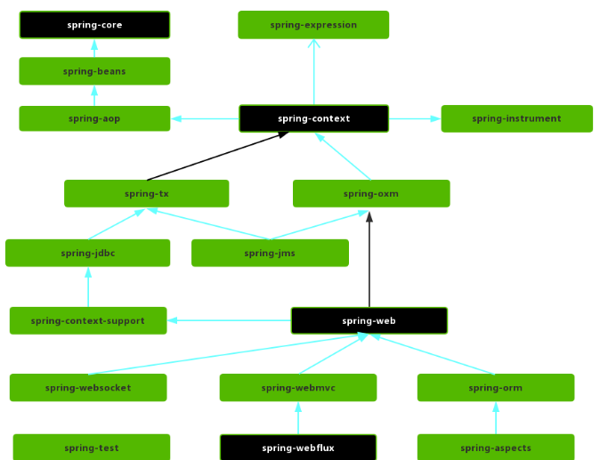

## 什么是 Spring

Spring 框架是一个开放源代码的 J2EE 应用程序框架，由 Rod Johnson 发起，是针对 bean 的生命周期进行管理的轻量级容器（lightweight container）。 Spring 解决了开发者在 J2EE 开发中遇到的许多常见的问题，提供了功能强大 IOC、AOP 及 Web MVC 等功能。Spring 可以单独应用于构筑应用程序，也可以和 Struts、Webwork、Tapestry 等众多 Web 框架组合使用。

Spring 框架分为模块。应用程序可以选择他们需要的模块。核心是核心容器的模块，包括配置模型和依赖注入机制。除此之外，Spring 框架还为不同的应用程序架构提供了基础支持，包括消息传递、事务数据和持久性以及 Web。它还包括基于 Servlet 的 Spring MVC Web 框架，以及并行的 Spring WebFlux 反应式 Web 框架。

Spring 框架的**特性**：

- 非侵入式：基于Spring开发的应用中的对象可以不依赖于Spring的API。
- 控制反转：IOC——Inversion of Control，指的是将对象的创建权交给 Spring 去创建。使用 Spring 之前，对象的创建都是由我们自己在代码中new创建。而使用 Spring 之后。对象的创建都是给了 Spring 框架。
- 依赖注入：DI——Dependency Injection，是指依赖的对象不需要手动调用 setXX 方法去设置，而是通过配置赋值。
- 面向切面编程：Aspect Oriented Programming——AOP
- 容器：Spring 是一个容器，因为它包含并且管理应用对象的生命周期
- 组件化：Spring 实现了使用简单的组件配置组合成一个复杂的应用。在 Spring 中可以使用XML和Java注解组合这些对象。
- 一站式：在 IOC 和 AOP 的基础上可以整合各种企业应用的开源框架和优秀的第三方类库（实际上 Spring 自身也提供了表现层的 SpringMVC 和持久层的 Spring JDBC）。

## Spring的组成

Spring 总共大约20个模块，这些模块被整合在核心容器（Core Container）、AOP和设备支持、数据访问及集成、Web、报文发送、Test 6个模块集合。

各个模块之间存在一些依赖关系如下：

### 核心容器

## Spring的核心功能

## 控制反转(IOC)和依赖注入(DI)

## 面向切面编程(AOP)

## 参考资料

[yaofengdoit--Spring源码分析系列](https://www.cnblogs.com/yaofengdoit/p/12057433.html)

